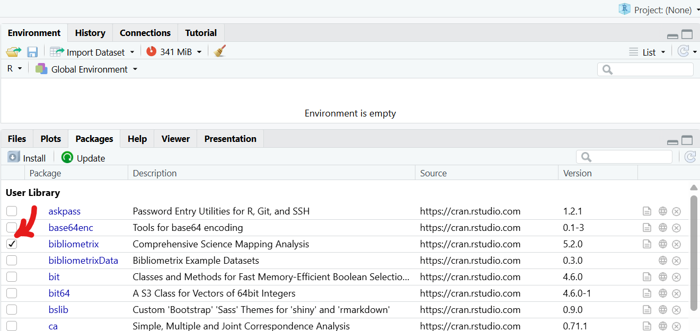

# Getting started with Bibliometrics analysis through Bibliometrix package
This repository contains the instructions used during the workshop for *bibliometric and scientometric analysis*.  
Follow the steps below to install R and Rstudio tools correctly on your computer. Then, we can install the _Bibliometrix_ package and start the analysis. 

> 📁 **Workshop Presentation**  
> The full slide deck can be found here:  
> [Presentation/An introduction to Litearture Review and Scientometric Analysis_TUe.pdf](Presentation/An introduction to Litearture Review and Scientometric Analysis_TUe.pdf)
---

## 1. About R and RStudio

### What is R?
R is a programming language used for statistics, data analysis, and scientific computing.  
It contains all core functions needed for processing and analysing metadata.

### What is RStudio?
RStudio is an integrated development environment that provides a user friendly interface for R.  
It includes panels for code, plots, files, and the R console.

### Relationship between R and RStudio  
- R provides the language.  
- RStudio provides the interface.  
- R must be installed before RStudio, because RStudio depends on it.

---

## 2. How to install R

1. Open the official R download page:  
   https://cran.r-project.org  
2. Chosse your closest location.
3. Choose your operating system and download the installer file.  
4. Run the installer (Accept the default settings unless you have a specific reason to change them).  

---

## 3. How to install RStudio

1. Go to the RStudio download page:  
   https://posit.co/download/rstudio-desktop  
2. Download the free RStudio Desktop version for your operating system.  
3. Run the installer and complete the installation based on your desired settings.  
4. Open RStudio. It will automatically detect your R installation (otherwise, you will get an error about compatibility).

Note that R and Rstudio environmets look visually different. In this tutorual, we use the R language in Rstudio environment. 

## 4. Install the Bibliometrix Package

_Bibliometrix_ package is required for scientometric and bibliometric analysis in Rstudio.

To read more about it, got to https://www.bibliometrix.org/home/  
Follow the steps below to install it:

1. Open **RStudio**.
2. In the Console panel, type the command below and press Enter:
   ```r
   install.packages("bibliometrix")
   ```
After installation completes, load the package with:
   ```r
   library(bibliometrix)
```

To confirm the package is working, check the help page:

   ```r
   ?bibliometrix
```

Otherwise, you can check if the box next to the Bibliometrix under the Packages tab is marked:

  
We have now two choices: (1) using the Biblioshiny or (2) using a code.


## 5. Start the Bibliometrix Package
### 5.1. Biblioshiny
To start working with the Biblioshiny app, type the following command in the RStudio Console:

```r
biblioshiny()
```
This will load the Shiny version of the Bibliometrix package in your default browser.
Please note that Biblioshiny is a convenient and quick way to begin the analysis, but it offers fewer customisation options compared to writing code directly in R.

### 5.2. Bibliometrix in Rstudio
In fact, when you load the Bibliometrix package, you will first be asked if you want to use Biblioshiny or not.  
**If you prefer to work with code, you can use the script provided in this repository here:  
[BibliometrixAnalysis.R](https://github.com/Z-Arghavan/Scientometrics-Analysis_Workshop/blob/main/BibliometrixAnalysis.R)**  
  
<details>
<summary><strong>Sources used for this script</strong></summary>

- Official Bibliometrix documentation  
  https://www.bibliometrix.org/vignettes/Introduction_to_bibliometrix.html
- Bibliometrix Reference Manual (older version)
  https://cran.r-project.org/web/packages/bibliometrix/bibliometrix.pdf

</details>

For more details about using the same code and explanations of the variables, you can watch my **video tutorials**  
available here:  
[YouTube Playlist](https://www.youtube.com/playlist?list=PLm8p4Z96J1LMVlBV_PljUSASiUWSakkmH)


